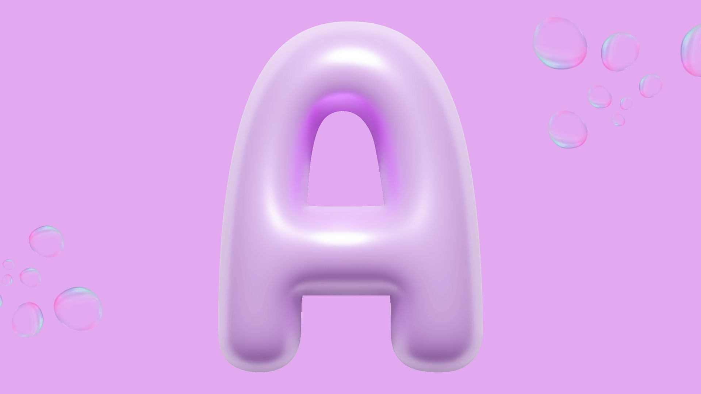

# English for Designers – Winter 2025

## About This Course
This repository documents my work for the course *English for Designers*.
The focus of the course is clear, accessible writing about design, process, and identity.

This work is created by a student of graphic design.

---

## Table of Contents
- [Content First](#content-first)
- First Impressions
- Process & Iterations
- Reflection

---

## Content First

### Drop Cap / Letter Design
**Chosen letter:** A

**Why I chose this letter:**  
I chose the letter A because it is simple and strong, but now I wanted to give it a playful twist. Turning it into a 3D purple balloon adds volume, fun, and a unique character while keeping it recognizable.

**Process:**  
I started by sketching the letter A in a standard font. Then, I added rounded, inflated edges to make it look like a balloon. I used gradients of purple to create a 3D effect, with highlights and soft shadows to simulate light reflecting off the surface. Finally, I refined the contours to keep the shape clean and readable, even with the playful, bouncy style.

---

### Alt Text Writing

**Alt text version 1:**  
A 3D purple balloon letter A with soft, rounded edges and glossy highlights.

**Alt text version 2:**  
A playful drop cap letter A shaped like a purple balloon, with light reflections creating a three-dimensional effect.

**Alt text version 3 (AI-assisted, edited):**  
A stylized purple balloon letter A, 3D with shiny surfaces and smooth curves, resembling a party balloon.

**Final alt text:**  
A 3D purple balloon letter A with soft curves, glossy highlights, and a playful, inflated look.

---

### Type Specimen

**Original text:**  
Typography plays an important role in visual communication. It helps guide the reader, creates hierarchy, and influences how content is perceived. In this design, the letter A is presented as a playful 3D purple balloon, adding a fun and eye-catching element while remaining readable. Good typography is not only decorative but also functional and accessible.

**Design notes:**  
I focused on readability, spacing, and hierarchy, while giving the initial letter a playful twist. The 3D purple balloon A adds volume, highlights, and a tactile feel, creating a visual focal point without sacrificing clarity. I maintained contrast between headings and body text and avoided unnecessary decoration.

---

## First Impressions

### Handshake
Hi, I’m Jevgenija, a graphic design student living in Prague with a focus on social media content, digital design and visual communication. I speak Czech, Russian and English. 

---

### About Me
I am a design student interested in visual communication, social marketing, and identity. I focus on visual communication, illustrattion, and social media.

---

## Process & Iterations
This section documents my design process, including sketches, experiments, mistakes, and revisions. I focused on testing different approaches and learning from each iteration.

---

## Reflection

**What I learned:**  
- Writing clearly about design is part of the design process  
- Accessibility and readability are essential  
- Simple solutions are often the strongest  

**What I want to improve:**  
- Writing confidence  
- Explaining my process in more detail

---

## Vas praktik

<!DOCTYPE html>
<html lang="en">
<head>
<meta charset="UTF-8">
<meta name="viewport" content="width=device-width, initial-scale=1.0">
<title>Váš praktik — Rebranding Case Study | Jevgenija Diděnko</title>
<link rel="preconnect" href="https://fonts.googleapis.com">
<link rel="preconnect" href="https://fonts.gstatic.com" crossorigin>
<link href="https://fonts.googleapis.com/css2?family=Fraunces:ital,opsz,wght@0,9..144,300..900;1,9..144,300..900&family=Nunito:wght@300;400;600;700;800;900&display=swap" rel="stylesheet">

</head>
<body>

<nav>
  
Váš/praktik <em style="font-style:italic; font-weight:400; opacity:0.5; margin-left:8px;">rebrand</em>

  <ul class="nav-links">
    <li><a href="#problem">Problem</a></li>
    <li><a href="#identity">Identity</a></li>
    <li><a href="#process">Process</a></li>
    <li><a href="#applications">Applications</a></li>
  </ul>
</nav>

<main>

<!-- HERO -->
<section class="hero">
  

    

      Bachelor's thesis · 2026
      

      Rebranding · Visual identity · Healthcare
    

    <h1>A clinic that's not <em>afraid</em> to be human.</h1>
    

      Case study of the rebranding for <strong>Váš praktik</strong> — from a scattered collection of animal illustrations to a coherent visual system built for adult patients of the digital generation.
    

    

      Visual identity
      Logo
      Mascot
      Web · Print · Outdoor
    

  

  

    

      
    

    
V·P monogram — original construction

  

  
Scroll

</section>

<!-- ABOUT -->
<section id="about">
  

    01
    About the project
    

  

  

    

      

        
Client

        
Váš praktik network of general practice clinics

      

      

        
Target audience

        
Adults 20–40 the digital generation

      

      

        
Role

        
Analysis, concept, visual system, applications

      

      

        
Year

        
2026

      

    

    

      <h2>A clinic for adults that looked like a <em>pediatric office</em>.</h2>
      

        Váš praktik is a network of modern general practice clinics. The ambulances run CRP, ECG, and blood pressure holter — technologically everything is up to standard. The problem was elsewhere: in the visual communication.
      

      

        The Instagram feed looked like a gallery of fairy-tale animals: a fly in a nurse's cap, a cat for home care, a hippo in the shower. For a patient in their productive years — the primary target group — this generated visual noise that weakened the professionalism and credibility of the brand.
      

      

        „Between the sterile big network and the traditional doctor's office, fill the space for a <em>young clinic for young people</em>."
      

      

        The goal of the rebranding wasn't to "repaint the logo". It was to redefine the relationship between doctor and patient — to create an identity that communicates both stability and humanity, technology and empathy. A safe place that doesn't have a tendency to alienate the patient.
      

    

  

</section>

<!-- PROBLEM / SOLUTION -->
<section id="problem">
  

    02
    Before / After
    

  

  <h2 class="reveal">Diagnosis of the old identity.</h2>

  

    

      Before
      <h3>Fragmented communication</h3>
      
The old identity lacked a visual anchor. Each social media post used a different style, different illustrations, different typography.

      <ul>
        <li data-mark="—">Poppins logotype + illustrative stethoscope — blurs when scaled down</li>
        <li data-mark="—">A plurality of animal illustrations without a unifying anchor</li>
        <li data-mark="—">"Praha" in the logo — limits expansion beyond the capital</li>
        <li data-mark="—">Visuals evoke pediatrics despite the focus on adults</li>
        <li data-mark="—">Inconsistency between web ↔ Instagram ↔ print</li>
      </ul>
    

    

      After
      <h3>A system, not a collection</h3>
      
The new identity stands on one concept — bridging tradition and technology. Everything else flows from it.

      <ul>
        <li data-mark="+">V·P monogram drawn in one continuous line; the cross emerges at the intersection</li>
        <li data-mark="+">Robot mascot as a modular visual system</li>
        <li data-mark="+">Pastel palette humanizes the clinical space</li>
        <li data-mark="+">Nunito — legible, friendly, digitally competent</li>
        <li data-mark="+">Tone of voice: „We're in this with you."</li>
      </ul>
    

  

</section>

<!-- IDENTITY -->
<section id="identity">
  

    03
    Visual identity
    

  

  <h2 class="reveal">Four building blocks of a <em>new language</em>.</h2>

  

    

      
Logo · Monogram

      <h3 class="card-title">One line. Two letters. A cross within.</h3>
      
The V·P monogram is drawn as a single continuous curve — softness, fluidity, a human touch. At the intersection of the lines a cross naturally emerges, a clinical symbol that isn't stuck on, but is the result of the geometry itself.

      

        
      

      

        

        

        

      

    

    

      
Palette

      <h3 class="card-title">Calm without sterility.</h3>
      
Grey as the technological backbone, balanced by emotional tones. No saturated blue. No hospital white. Pastels that humanize.

      

        

          
Steel

          
#BABEC1

        

        

          
Rose

          
#F7BDC7

        

        

          
Lavender

          
#D5BFD6

        

        

          
Terra

          
#EC9B9F

        

      

    

    

      
Typography

      <h3 class="card-title">Nunito — round, clear, friendly.</h3>
      

        Aa
        Nunito ExtraBold / SemiBold
      

      
Rounded terminals harmonize with the organic line of the logo. High legibility at small formats and in internal documentation.

      

        Display · 900
        Body · 600/400
      

    

    

      
Mascot

      <h3 class="card-title">A robot with a hand-drawn line.</h3>
      
A humanoid figure at the boundary of technology and empathy. A heart with a pulse on the chest, an organic illustrative line — a machine that bears a human imprint. Modular system: doctor, nurse, educator, in-app guide.

      
    

  

</section>

<!-- PROCESS -->
<section id="process" class="process">
  

    04
    Process
    

  

  <h2 class="reveal">From analysis to <em>system</em>.</h2>

  

    

      
01

      <h4>Audit</h4>
      
An in-depth analysis of current communication across all channels. Identifying the gap between the service offered and how it presents itself visually.

    

    

      
02

      <h4>Competition</h4>
      
A comparison of five players — from small clinics (PrahaMed, Salubrita) to networks (EUC, AGEL) and premium care (Canadian Medical). Looking for the white space.

    

    

      
03

      <h4>Persona</h4>
      
Eliška, 24, student. Prefers digital over phone. Looking for a clinic that feels like a safe place, not a government office.

    

    

      
04

      <h4>System</h4>
      
Logo, palette, typography, mascot, tone of voice. Applied to every touchpoint — print, web, interior, social.

    

  

</section>

<!-- APPLICATIONS -->
<section id="applications">
  

    05
    Applications
    

  

  <h2 class="reveal">One system. <em>Many touchpoints</em>.</h2>
  

    The identity lives on posters in the waiting room, in Instagram posts, on the doctors' business cards, on the 3D logo above the entrance, and in a guerrilla campaign at a trade fair. The same voice everywhere.
  

  

    

      

        
      

      

        
01 · Business cards

        
Rose on rose.

        
A monochromatic palette derived from the brand's signature color. The front carries the bold mark; the back keeps contact information clean and scannable.

      

    

    

      

        
      

      

        
02 · Plush mascot

        
A robot you can hug.

        
A physical version of the mascot for the waiting room — a humanizing object that softens the clinical environment.

      

    

    

      

        
      

      

        
03 · Instagram

        
Education, not noise.

        
Templates combine real photos from the clinic with mascot illustrations. Topics like prevention, modern diagnostics, and lifestyle tips delivered with visual consistency.

      

    

    

      

        
      

      

        
04 · Indoor marketing

        
Uniforms. Notebooks. Mugs.

        
Discreetly branded interior elements that improve both the patient's stay and the staff's daily routine — a coherent ecosystem of small, considered details.

      

    

    

      

        
      

      

        
05 · Exterior / 3D signage

        
A storefront that breathes.

        
A 3D logo above the entrance, large-format glazing, soft material palette — a "healing environment" that signals trust at first contact.

      

    

    

      

        
      

      

        
06 · Guerrilla campaign

        
Branded glucose at a trade fair.

        
Free dextrose tabs distributed during peak fatigue hours. Each wrapper carries a QR code leading directly to the booking system. Slogan: "At the fair, sugar saves you. In life, Váš praktik."

      

    

  

</section>

<!-- OUTRO -->
<section class="outro">
  

    06
    Outcome
  

  <h2 class="reveal">Rebranding isn't <em>a new logo</em>. It's a new relationship.</h2>
  

    Today Váš praktik speaks with one voice — online, in the waiting room, and in stories. A patient meets the brand at home on their phone or at the reception desk and, in either place, recognizes that they're home.
  

  <a href="#" class="signature reveal">
    Jevgenija Diděnko
    · BA · VŠKK 2026
  </a>
</section>

</main>

<footer>
  
Váš praktik · Rebranding case study

  
Bachelor's thesis · VŠKK 2026 · J. Diděnko

</footer>

</body>
</html>
